# **Typora 数学符号<https://blog.csdn.net/wait_for_eva/article/details/84307306**>

概念模型为独力于具体的计算机系统的数据模型

数据库体系结构1.DBMS角度：三级模式**两级映像（体现了逻辑独立、物理独立？？）**、模式、内模式、外模式

​		2.用户角度：单用户结构、主从式（如：多个收银台连接一台主机）、分布式（公司各地的分部）、客户端服务（如QQ）、浏览器服务（如淘宝）

DDL:定义模式的语言Data Definition Language 

外模式：（子模式、用户模式）当

三级模式：外模式、模式、内模式

两级映像：外模式/模式映像、模式/内模式映像 

外模式/模式映像

模式改变，由数据库管理员对各个外模式/模式的映像作相改变，可以使外模式保持不变。应用程序是依据数据的外模式编写的，从而应用程序不用修改，保证了数据与程序的逻辑独立性，简称数据的逻辑独立性。

模式/内模式映像 

当数据库的存储结构改变时，由数据管理员对模式/内模式映像作相应改变，可以使模式保持不变，从而应用程序也不必改变。保证了数据与程序的物理独立性，简称数据的物理独立性。

模式：涉及全体数据的逻辑结构特征（结构中间层、设计核心）

内模式：涉及索引、数据的压缩、加密、对数据的具体规定、定义着存取结构和存取方法、

模式——内模式（一对一）

模式——外模式（一对多）如学籍——（教务，教学，宿舍）

外模式——应用（可一对多，不能多对一）式。对于每一个外模式，数据库系统都有一个外模式／模式映像，它定义了该外模式与模式之间的对应关系，即如何从外模式找到其对应的模这些映像定义通常包含在各自外模式的描述中。

索引：DBMS决定了素因子啊查询的时候是否启用

*数据独立性*是指应用程序和*数据*结构之间相互*独立*, 互不影响。

关系模式 现实世界随着时间在不断地变化，因而在不同的时刻，关系模式的关系也会有所变化。但是，现实世界的许多己有事实限定了关系模式所有可能的关系必须满足一定的完整性约束条件化

​																					//2020-03-10

数据库三要素（数据结构、数据操作、完整性约束条件）

关系数据库系统（当今最重要、最流行的数据库系统、**集合论处理数据**）

Oracle DB2 大型商用 || MySQL 开放源码  ||  金仓、DM/2（达梦）国产

### 关系数据结构

####  关系

就是现实中的实体以及联系	

##### 域

一组同类型的值的集合，，，往往是表的一列，也有可能会对应多列

##### 笛卡尔积

，，，域的排列组合

##### 关系

###### 关系，属性，元组

关系就是笛卡尔积的**有限**子集，，，元组的集合，，一张表

元组就是域的一种组合，，，表的一行

属性，，，表的一列

###### 候选码，主码，主属性

候选码唯一标识一个元组，**主码**是候选码，

由一个或多个候选码得到唯一的主码

主码不为空值，空值：没有、无意义、不确定的值

###### 基本关系的性质

三类关系：基表（展示存储内容）、查询表（展示查询结果）、视图表（不是真的表，虚表）

####  关系模式

是对关系的描述关系的属性构成、来自的域、映像关系、元组语义、完整系约束条件、

关系模式是型，关系是值

关系模式为静态，关系为动态

关系模式可以形式化地表示为：

​      R（U，D，dom，F）

  R      关系名

  U       组成该关系的属性名集合

  D       属性组U中属性所来自的域，，，即数据类型

  dom   属性向域的映象集合，，即数据长度

  F        属性间的数据依赖关系集合

**关系模式三元组  R（U，F）**

####  关系数据库

关系的集合，，，表的集合

型：关系数据库模式、**值**：模式对应的关系的集合，简称关系数据库

###  关系的数据操作集合

#### 查询（最主要的操作）

##### 选择、投影、连接、除、并、交、差

####  数据更新

##### 插入，删除，修改

非关系型数据库，一次一记录

关系数据语言上，关系代数、元组关系演算、域关系演算在表达能力上是完全等价的

###  关系的完整性约束

####  实体完整性（必有）

主码非空

####  参照完整性（必有）

关系的引用

#####  外码 

**参照关系**  引用**被参照关系**的主码，在参照关系中称之为外码

####  用户定义的完整性

对入库的数据有着限制，如性别，只让选择男或女

关系型数据库管理系统三个机制：定义、检验、违规处理

​																					//2020-03-12

#### 关系代数

一种抽象的查询语言

**三要素**：运算对象、运算结果、运算符 （前两者内容都为"关系"）

R，t$\epsilon$ R，$t_r[A_i]$

元组$\epsilon$ 关系    

（我的理解：t是属于某张表的一行）

$t_r[A_i]$ （我的理解：R关系中的t元组A属性的值的集合）

R为n目关系：关系R中有n列

象集：满足t元组A属性的元组除A意外其他属性值的集合

##### 传统的集合运算

###### 并（增加原属性没有的值）

​	R∪S 

###### 差（减去没有的情况）

​	R - S 

###### 交（满足一个至少的关系）

​	R∩S  至少读过同一本书，也就是说，他们读书内部编码有共同点

###### 广义笛卡尔集（两次三次四次）

​	R X S			比如：查询结过两次不同书的作者

##### 专门的关系运算

###### 选择（选出满足条件的元组）

属性名字可以用序号代替，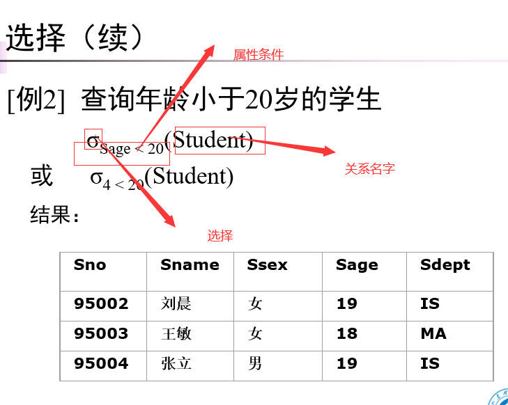

######  投影（从元组中筛选出需要的属性）

选择出指定的属性，形成一个可能含有重复行的表 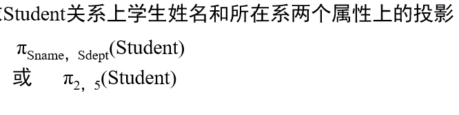

###### 连接（增加原来没有的属性）

满足一定条件，不同关系的元组合并

等值连接（不用去重，还要标明相同属性组来自谁如：R.B S.B），也有不等值连接

自然连接（特殊的等值连接，R(n)\S(m)一定要有一例相同才能自然连接，**且会去掉相同的属性组**，故自然连接最大是n+m-1

悬浮元组：自然连接被舍弃的元组

外连接：强行保留悬浮元组，并将没有属性的值赋空

###### 除（都、所有、全  关键词出现时）

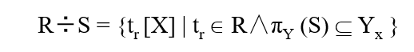

通俗解释：除得到的是R中满足条件的某一属性列

（条件：该属性列的象集（即，Y：其他信息的值的集合）要包含S中Y的投影的全部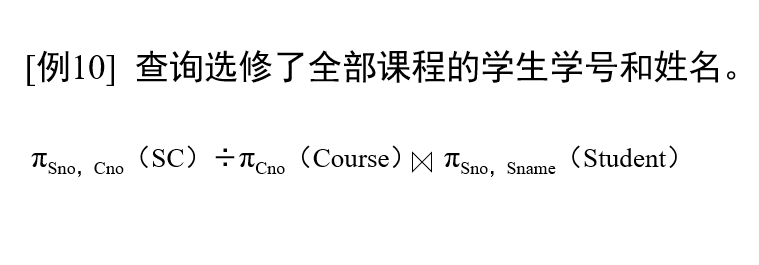

S(A,B,C)  R(C,D)  R%S得到AB的集合

关系代数运算是以（关系运算 ）为基础的运算？？

从一个数据库文件中取出满足某个条件的所有记录形成一个新的数据库文件的操作是（连接 ）操作

关系代数中的连接操作是由（ 笛卡尔积和选择）操作组合而成 。

一个除法例子：计算机系学生都学的课程的课程号

分析主干：  研究的是课程，条件在于计算机学生

​			课程/学生

进一步分析：除条件具体是什么，留什么做结果

​			条件：用学生学号代替学生

​			要留课程号，所以投影必须有学号和课程号，要找到这样的主体

​			π学号,课程号(选课) ÷π学号(σ所在系='计算机'(学生))

要拿到课程的课程号     “都”，除法落实了

选第一个是对的！！！

​																					//2020-03-17

### 规范化

**要求：能够判断该关系模式属于第几范式，能把该关系模式分解为符合2NF、3NF或BCNF要求的关系模式集合**

规范化理论，通过**分解关系模式**来**消除其中不合适的数据依赖**，以解决插入异常、删除异常、更新异常和数据冗余问题。

模式分解可以转换为若干个高一级范式的关系模式的集合，这种过程就叫**规范化**

#### 函数依赖（FD）

定义属性值间的相互关连（主要体现于值的相等与否），这就是数据依赖，它是数据库模式设计的关键

例如：学生的学号是唯一的，学生姓名可以通过学号得到唯一的确定，学号和姓名就存在数据依赖

‘好’的关系模式：不会发生插入异常、删除异常、更新异常，数据冗余应尽可能少、

两个元组在X上的属性值相等，而在Y上的属性也相等，则称 “X函数确定Y” 或  “Y函数依赖于X”，记作X→Y。同时也说明，称X是决定属性组  

平凡函数依赖，非平凡函数依赖

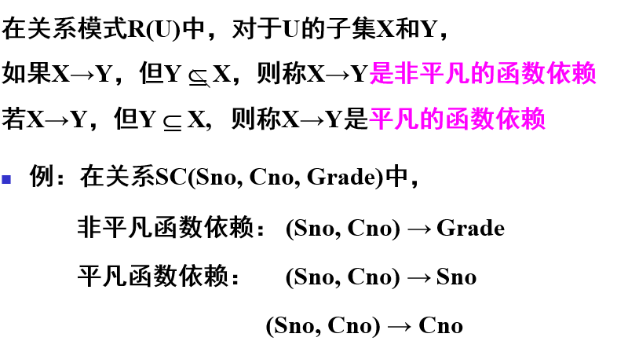

（Y对X）完全函数依赖：X确定Y，X的真子集不能确定Y，反之，真子集可以确定Y，称为，部分函数依赖

（Z对X）传递函数依赖：X→Y  （单项确定）且 Y→Z    

#### 码

这里说的码就是唯一确定一个元组的就是码      候选码和码是一个概念

#### 范式

范式是符合某一种级别的关系模式的集合

模式分解可以转换为若干个高一级范式的关系模式的集合，这种过程就叫规范化

**投影分解法**

画函数依赖图

#### 2NF

第一范式是对关系模式的最起码的要求  是一个规则的二维表格就行

每一个非主属性**完全函数依赖**于码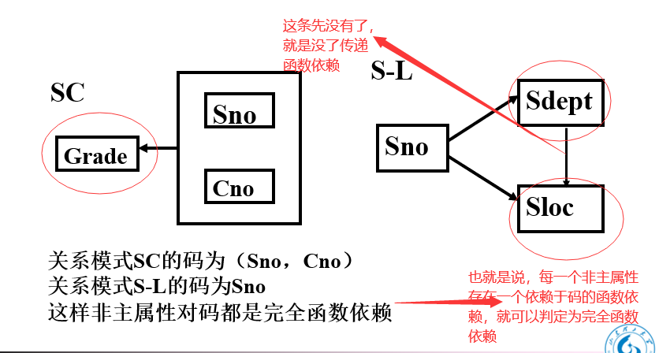

#### 3NF

每一个**非主属性！！！**既**完全函数依赖**于码也**不传递函数依赖**于码 （码和码之间传递无所谓）

一般的关系模式符合第三范式就比较好

特殊情况一、如果是全码情况，那么一定是无非主属性，属于第三范式

特殊情况二、(S，C)→T，(S，T)→C，T→C    (S，C)和(S，T)都是候选码

此时有一个环，换中任意一个都可以认为是码，所以也不算非主属性函数传递依赖！！

#### BCNF

（3NF加强）每一个决定属性因素都包含码

**决定因素中每个都是码**（分两种情况）

情况一：只有一个候选码，3NF=BCNF

情况二：多个候选码（只要不出现候选码中再单独分出一个作为决定因素去确定其它属性的情况）

如：(S，C)→T，(S，T)→C，T→C    (S，C)和(S，T)都是候选码

T→C ,T是决定因素，T不包含码

#### 多值依赖（MVD）

具有对称性

函数依赖是多值依赖的特殊情况

#### 4NF

并不是规范化程度越高，模式就越好

必须结合应用环境和现实世界的具体情况合理地选择数据库模式

​																					//2020-03-19

### Armstrong公理

（1）自反律    若Y 包含于X 包含于 U，则X→Y为F所蕴含（平凡函数依赖、父子依赖）。

（2）增广律    若X→Y为F所蕴含，且Z 包含于 U，则XZ→YZ为F所蕴含。

（3）传递律    若X→Y及Y→Z为F所蕴含，则X→Z为F所蕴含（传递函数依赖）

（4）合并规则	由X→Y，X→Z，有X→YZ

（5）伪传递规则   由X→Y，WY→Z，有XW→Z

（6）分解规则    由X→Y及 Z包含于Y，有X→Z

### 属性集X关于函数依赖集F的闭包的定义

在关系模式R<U，F>中为F所逻辑蕴含的函数依赖的全体叫作**F的闭包**（列出来会很麻烦，所以不用）

Armstrong公理系统是有效的、完备的

常用的是**属性闭包**$X_F^+$=?

F->A   A->B

求F属性闭包：

因为F->A 

则$X_F^+$=FA

因为A->B

则$X_F^+$=FAB

### 根据属性闭包确定关系模式的候选码，由此分析关系模式属于第几范式

方法一、先将属性根据依赖关系分类

**L类**：只出现在函数依赖的左边的属性

R类：只出现在函数依赖的右边的属性

N类：在函数依赖的两边均未出现的属性

LR类：出现在函数依赖的两边的属性

**如果X是L或N类属性，则X必为R的任一候选码的成员**

**如果X是R类属性，则X必不在任何候选码中**

**如果X是L和N类组成的属性组，且X+包含了全部属性，则X是R的唯一候选码**  (用来找候选码)

A->A是隐含条件，闭包中一定含有自身

方法二、函数依赖图

可以确定所有的候选码（候选码不唯一的情况下超好用）

比如 A->B  B->C->D->B(环)  A无入边，所以候选码就是AB、AC、AD

#### 最小依赖集或最小覆盖

##### 满足的条件：

1.函数依赖的右部仅含有一个属性

2.F中不存在这样的函数依赖X→A，使得F与F-{X→A}等价（没有冗余的函数依赖）

3.F中不存在这样的函数依赖X→A，X有真子集Z使得F-{X→A}∪{Z→A}与F等价（每个FD的左边没有冗余的属性）把低一级的关系模式分解为若干个高一级的关系模式的方法不唯一

##### 极小化过程：

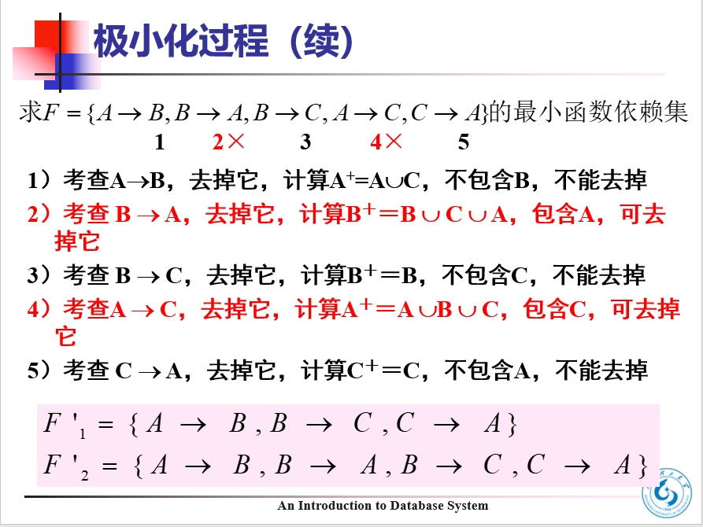

**最小依赖集$F_m$不唯一**

极小化也是检验F是否为极小依赖集的一个算法

### 分解无损连接和保持函数依赖

具有**无损连接性**的分解保证不丢失信息

无损连接性不一定能解决插入异常、删除异常、修改复杂、数据冗余等问题

如果一个分解**保持了函数依赖**，则它可以减轻或解决各种异常情况

根据关系数据库规范化理论，关系数据库中的关系要满足第一范式。下面"部门"关系中，因哪个属性而使它不满足第一范式? (            )。部门(部门号，部门名，部门成员，部门总经理)，部门号由长度为3的数字组成，部门名称由长度为20的字符串组成，部门成员由属于部门的员工编号和姓名组成，部门总经理为长度为10的该部门总经理姓名。

部门成员  因为还可以分

设有关系模式R（S，D，M），其函数依赖集：F＝{S→D，D→M}，则关系模式R的规范化程度最高达到（ 1nf）。s是码，D→M所以M不完全依赖S，可以通过题干中提到的，D来确定，**该题不是完全依赖**

​																					//2020-03-24

### 数据库设计概述

在数据库领域内，通常把使用数据库的各类信息系统都称为数据库应用系统

广义地讲，设计整个数据库应用系统。

侠义地讲，是指设计数据库本身

高效率的运行环境

数据库数据的存取效率高

数据库存储空间的利用率高

数据库系统运行管理的效率高

五类人员：

**系统分析人员**和**数据库设计人员**

核心人员—全程参与设计，其水平决定了数据库系统质量。

**数据库管理员**和用户

主要参加需求分析和数据库的运行和维护。

**应用开发人员**

负责编制程序和准备软硬件环境，在系统实施阶段参与进来。

#### 数据库设计的特点

三分技术，七分管理，十二分基础数据

结构（数据）设计和行为（处理）设计相结合

###  需求分析

设计一个数据库（需求分析->E-R模型->关系模式->物理结构）

重点：数据和处理

任务：

要处理的对象、确定新系统的功能、户的各种需求、**数据库今后可扩展性**

方法：

自上而下

数据字典：

数据字典是关于数据库中数据的描述，即元数据，不是数据本身

数据字典是进行详细的数据收集和数据分析所获得的主要结果

和关系数据库管理系统中数据字典的区别和联系

数据字典的内容：

数据项

数据结构

数据流

数据存储

处理过程

**数据流图（简称DFD）**是描述系统中数据变换的图形工具。数据流程图是用于数据库设计中（ 需求分析）阶段的工具。（记住）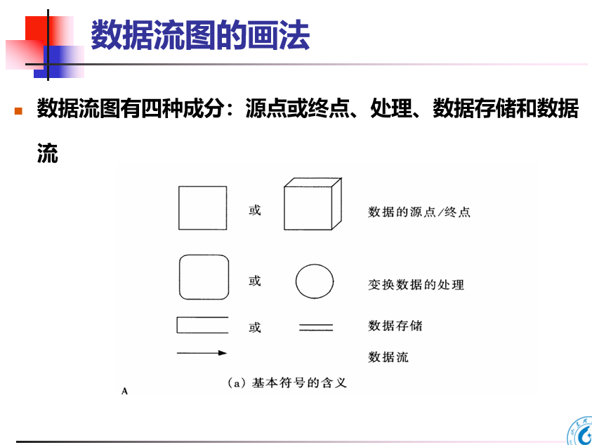

​																					//2020-03-26

### 概念结构设计

E-R模型的基本概念和图示方法以及E-R模型的设计

**描述概念模型的工具：E-R模型**

两个**实体性**（实体，真实存在的，如人，班级，学生，  学号就不是，他是描述学生的一个特征）之间的联系：

①一对一联系（1∶1）

②一对多联系（1∶n）

③多对多联系（m∶n）课程：选修学生		

**E-R图提供了表示实体型、属性和联系的方法**

**实体型**：用矩形表示，矩形框内写明实体名。

**属性**：用椭圆形表示，并用无向边将其与相应的实体型连接起来

**联系**：用菱形表示，菱形框内写明联系名，并用无向边分别与有关实体型连接起来，同时在无向边旁标上联系的类型（1∶1，1∶n或m∶n）  （**这个联系可以是个实体，也可以是个概念，可以拥有自己的属性**）

联系的度：参与联系的实体型的数目

关系数据库中，实现实体之间的联系是通过关系与关系之间的（公共属性 ） 

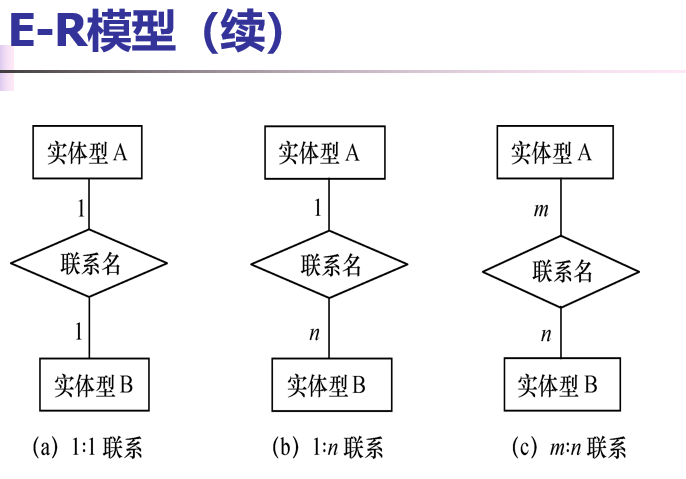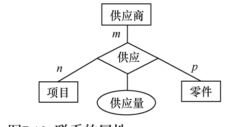

（仅作了解）ISA联系：即子类继承了父类的所有属性

（仅作了解）基数约束：参与联系的每个实体型用基数约束说明实体型中的任何一个实体可以在联系中出现的最少次数和最多次数

**UML 中的类（class）大致对应E-R图中的实体**（这里着重研究的是uml的类，后面会专门学uml）

UML中的类具有面向对象的特征，它不仅描述对象的属性，还包含对象的方法

**实体型**：用类表示，矩形框中实体名放在上不，下面列出属性名

**实体的码**：在类图中在属性后面加“PK”来表示码属性

**联系**：用类图之间的“关联”来表示

两条准则：

1）作为属性，不能再具有需要描述的性质。属性必须是不可分的数据项，不能包含其他属性。

2）属性不能与其他实体具有联系，即E-R图中所表示的联系是实体之间的联系。

E-R图的集成

E-R图的集成一般需要分两步 合并、	修改和重构

子系统E-R图之间的冲突主要有三类：

①属性冲突

②命名冲突

③结构冲突 例如，职工在某一局部应用中被当作实体，而在另一局部应用中则被当作属性。

解决方法：把属性变换为实体或把实体变换为属性，使同一对象具有相同的抽象。

​	同一实体在不同子系统的E-R图中所包含的属性个数和属性排列次序不完全相同。

解决方法：使该实体的属性取各子系统的E-R图中属性的并集，再适当调整属性的次序

并不是所有的冗余数据与冗余联系都必须加以消除，有时为了提高效率，不得不以冗余信息作为代价。

​																					//2020-03-31

### 逻辑结构设计

**E-R图向关系模型的转换**

**转换原则**：

1、一个实体型转换为一个关系模式（实体的属性即关系的属性）

2.每一个联系也要分别转换为一个关系模式（加上联系本身的属性）

1：1 :以任意一端实体型的码作为这个关系模式的码

1：n :以n端实体型的码作为这个关系模式的码

m: n :以任意m、n端实体型的码的组合作为这个关系模式的码

3.码相同的两个关系模式可以合并（要记得去掉同义属性，同义属性可能不同名字）

数据模型的优化

第几范式（规范化）、极小化、

对关系模式进行必要分解，**提高数据操作效率和存储空间的利用率**

l水平分解：分元组（如：常用的元组拿出来作子关系）

l垂直分解：分属性（如：把常用的属性拿出来得到一个只具有常用属性的关系）

**设计用户子模式**

**注重考虑用户的习惯与方便**

1.用户习惯的别名用视图机制可以在设计用户视图时可以重新定义某些属性名，使其与用户习惯一致，以方便使用。

2.针对不同级别的用户定义不同的视图，以保证系统的安全性。

简化用户对系统的使用，可以将这些复杂查询定义为视图

### 数据库的物理设计

数据库在物理设备上的存储结构与存取方法称为数据库的物理结构，它依赖于选定的数据库管理系统

（为一个给定的逻辑数据模型选取一个最适合应用要求的物理结构的过程，就是数据库的物理设计）

**关系模式存取方法**：

B+树、（根据应用确定对哪些属性建立索引、组合索引、唯一索引）

Hash索引、

**聚簇存取方法**（在一个基本表上最多只能建立一个聚簇索引、聚簇索引的索引项顺序与表中元组的物理顺序一致。特点：很少对基表进行增删操作、优点：提高某些特定应用的性能、节省存储空间聚簇码相同的元组集中在一起了

 很少对其中的变长列进行修改操作 聚簇的**局限性**：建立维护开销大）

**评价物理结构**（估算结果进行权衡、比较，选择出一个较优的合理的物理结构）

l存储空间

l 存取时间

l 维护代价

在逻辑设计阶段将E-R图转换成具体的数据库产品支持的数据模型如关系模型，形成数据库逻辑模式。

然后根据用户处理的要求，安全性的考虑，在基本表的基础上再建立必要的视图，形成数据的外模式

在物理设计阶段根据DBMS特点和处理的需要，进行物理存储安排，设计索引，形成数据库内模式

### 数据库实施和维护

​																					//2020-04-02

SQL语句

本节课重点是数据定义、数据更新、数据查询会使用

（课程设计都可以用）

1.可以使用网络版apex写SQL语句  apex.oracle.com

免费试用--------请求免费工作区------------SQL工作室--------SQL命令

下一次直接登录即可

一个数据库管理需要sql服务器、和监听服务，缺一个就不能正常使用

2.Oracle本地版

3.SQLserver

4.MySQL

​																					//2020-04-09

### SQL语句（表、索引的学习）

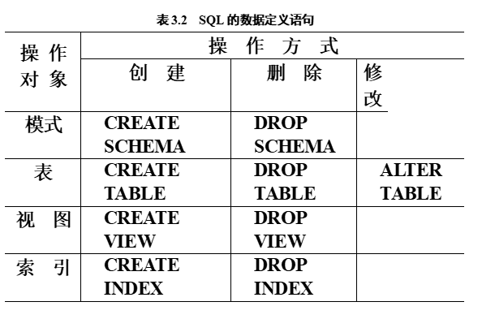

**语句中不区分大小写**     例如：desc DESC 一样的

**一个语句可以分段多行，但是多个SQL语句时，语句结束要加分号，将sql语句之间分隔开，不然会语法报错**

数据字典：n关系数据库管理系统内部的一组系统表，它记录了数据库中所有定义信息：

ü关系模式定义

ü视图定义

ü索引定义

ü完整性约束定义

ü各类用户对数据库的操作权限

ü统计信息等

SQL中域的概念用数据类型来实现

定义表的属性时需要指明其数据类型及长度

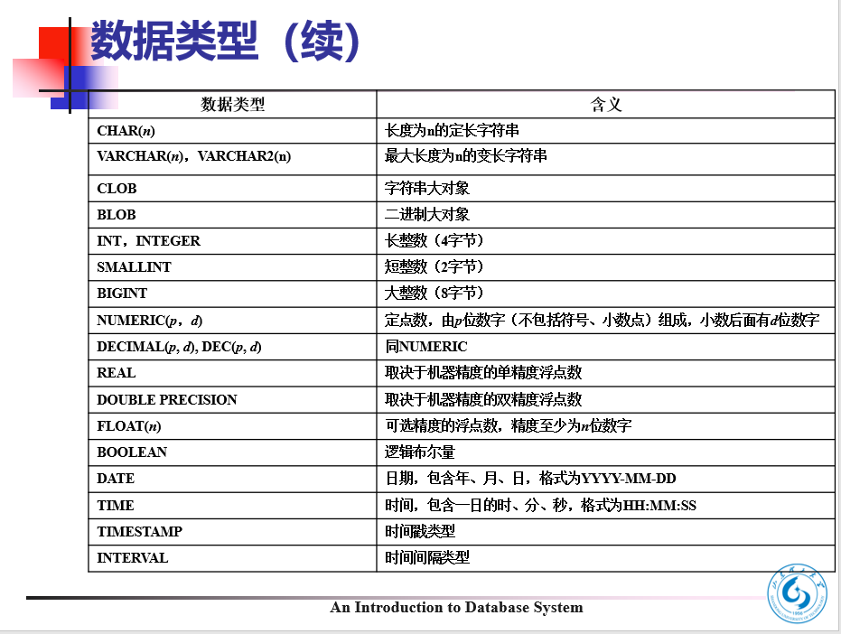

表的名字不建议使用中文，

相比SQL语句，图形化界面操作会更加常用

查询（单表查询、连接查询、嵌套查询）

char 定长类型，不满长度在后面空格补充

varchar 可变长 

#### 表操作（表字段）

1.建表操作：

CREATE TABLE Student

​        (Sno      CHAR(11)  PRIMARY KEY,		//主键    可单独一行，PRIMARY KEY（cno,sno）

​         Sname  VARCHAR2(20)  UNIQUE,       //格式:名字 类型（大小） 完整性约束（主键、非空、唯一性约束UNIQUE。。。）   

​         Ssex     CHAR(2) not null ,				//非空

​         Sage     INT,

​         Sdept    VARCHAR2(30)，

FOREIGN KEY(Cpno)   REFERENCES Course(Cno) //  外键：  表级完整性约束，参照完整性

​      ); 

2.修改表（增删）

ALTER table table_name add 新列 类型（大小） 完整性约束

alter table table_name drop column 列名

ALTER TABLE Student DROP UNIQUE(Sname)  删除了唯一性约束

3.删表

drop table table_name

4.查看表

describe table_name 

#### 表数据管理（表数据）

增：insert into table_name () values () 

删：DELETE FROM table_name [WHERE Clause]

改：

​																					//2020-04-14

#### 索引操作

1.建立索引

CREATE\[  UNIQUE ][CLUSTER] INDEX <索引名>  ON <表名(<列名\[<次序],<列名[<次序] >…)

次序：desc（降序） （不写的话，默认升序asc）

(**说明：看见小括号，写时候，带着小括号，其他括号不用写，，看见的中括号，表示其中的内容可以不写，选择默认情况，尖括号，表示自定义内容，或者就是选择次序之类的内容**)

create index pp on student( age DESC,sno)

建立聚簇索引后，基表中数据也需要按指定的聚簇属性值的升序或降序存放[CLUSTER]（不常用）

2.删除索引

drop index index_name

#### 数据查询

##### 单表查询

1.常规操作

SELECT 列名1,列名2… from table_name

（**select * ，不建议使用**，重要是理解为什么会降低效率，以及代码中尽量少的使用select * 。
 1，数据库需要知道 * 等于什么 = 查数据字典会增大开销（记录数据库和应用程序元数据的目录）
 2，多出一些不用的列，这些列可能正好不在索引的范围之内（索引的好处不多说）select * 杜绝了索引覆盖的可能性，而索引覆盖又是速度极快，效率极高，业界极为推荐的查询方式。
 3，不需要的字段会增加数据传输的时间，即使 mysql 服务器和客户端是在同一台机器上，使用的协议还是 tcp，通信也是需要额外的时间。
 4，大字段，例如很长的 varchar，blob，text。准确来说，长度超过 728 字节的时候，会把超出的数据放到另外一个地方，因此读取这条记录会增加一次 io 操作。----mysql innodb
 5，影响数据库自动重写优化SQL（类似 Java 中编译 class 时的编译器自动优化） 。----Oracle
 6，select * 数据库需要解析更多的 对象，字段，权限，属性相关，在 SQL 语句复杂，硬解析较多的情况下，会对数据库造成沉重的负担
 7，额外的 io，内存和 cpu 的消耗，因为多取了不必要的列。
 8，用 SELECT * 需谨慎，因为一旦列的个数或顺序更改，就有可能程序执行失败。

链接：https://www.jianshu.com/p/2ffd8d806109）

所以，需要什么列，取出什么列

2.查询经过计算的值，查询学生出生年月

SELECT Sname, TO_CHAR(sysdate, 'yyyy')-Sage FROM Student

3.查询结果去重(默认是不去重[all]  ，另外，一个SQL语句中，只写一个distinct)

select [**distinct**]…from …   

4.select…from…where 条件

确定范围条件：**WHERE** Sage **BETWEEN** 20 **AND** 23

比较大小条件：**WHERE** Grade<60

确定集合条件：**WHERE** Sdept **IN** ( 'IS', 'MA', 'CS')  **WHERE** Sdept  **NOT IN** ( 'MA', 'CS' )

字符串匹配条件：**WHERE** school = ‘SDUT’          （**兼容性：字符串用单引号，不建议双引号**）

字符串匹配条件（通配符_）：**WHERE** school **like** 'S\_'           （**兼容性：字符串用单引号，不建议双引号**）

（筛选结果，S开头，长度为2的字符串）

字符串匹配条件（通配符%）：**WHERE** school **like** 'S%T'     （**兼容性：字符串用单引号，不建议双引号**）

（筛选结果，S开头，T结尾，任意长度（长度可以为0）的字符串）

5.查询结果出现转义字符（如内容中有%）

select …from…**where** …**like** …**escape** '\'

注意mysql中不需要escape，只在like中添加转义字符\就可以：

**SELECT**   sex,age,sno from student **WHERE** sex **LIKE** 'q**\\**%'    

（该结果为 q%）

6.空值查询条件：**WHERE**  Grade **IS NULL**

7.非空值查询条件：**WHERE**  Grade **IS NOT NULL**

8.多重条件查询（and 优先级 高于 or 可以用括号提高优先级）

WHERE Sdept= 'IS' **AND** Sage<20  

9.对结果排序

**ORDER** **BY** Grade **DESC** ，age

（该结果：先成绩降序，相同成绩，年龄升序）

10.使用聚集函数 （除了count（*） 都会跳过空值，然而，mysql实验中做不到出现空值！！！！）

④　计数 ：count（[DISTINCT|ALL] <列名>）

⑤　求和：sum（）

⑥　求平均值：avg（）

⑦　求最大值：MAX（）

⑧　求最小值：min（）

11.查询结果分组

select 聚集函数…from…**GROUP BY** Cno 

（**这样使用聚集函数才有意义**）

SELECT Sno

​     FROM  SC

​     GROUP BY Sno

​     

12.查询结果分组，且对组有要求

**group by** Sno **HAVING**  COUNT(*) >9

​																					//2020-04-16

##### 连接查询

用来连接两个表的条件称为**连接条件**或连接谓词

连接条件中的各连接字段类型必须是可比的，但不必是相同的

连接操作的执行过程：

嵌套循环法：表1的元组，要依次与表2各元组匹配

排序合并法：表1元组与表2元组匹配，匹配成功后，表1下一个元组从表2上一次匹配的位置往下匹配

索引连接：对表2建立索引，

索引链接

1.广义笛卡尔积查询

select * from table1_name,table2_name

（没有实际意义，只是作为接下来的铺垫）

2.**等值连接**（建立起以t1的A列和t2的B列的等值连接，**此时重复项并未被去掉，属于等值连接**）

select * from t1_name,t2_name
WHERE t1.A = t2.B

（**如果查看的列不只在一个表中，要加表名前缀table_name.列名**，换句话说，任何子句中引用表1和表2中同名属性时，都必须加表名前缀。引用唯一属性名时可以加也可以省略表名前缀。 ）

select t_name1.x from t1_name,t2_name
WHERE t1.A = t2.B

3.**自然连接**

方式一、

**select** * **from** student d1 **NATURAL join** student1 d2

**where** d1.age = d2.age;

方式二、（等值连接，手动去重，原理：投影属性格式为 表名前缀格式， *就不能出现了）

select t1_name.X from t1_name,t2_name
WHERE t1.A = t2.B

例子：

SELECT  Student.Sno, Sname, Ssex, Sage, Sdept, Cno, Grade

  FROM     Student,  SC

  WHERE  Student.Sno = SC.Sno  ;

4.**自身连接**

（**需要给表起别名以示区别，由于所有属性名都是同名属性，因此必须使用别名前缀.**）

查询每一门课的间接先修课（即先修课的先修课）

SELECT  FIRST.Cno,  SECOND.Cpno

  FROM  Course  d1  Course  d2

  WHERE  d1.Cpno = d2.Cno  ; 

5.**外连接（分主体、客体）**

外连接与普通连接的区别

**普通连接**操作只输出满足连接条件的元组；**外连接**操作以指定表为连接主体，将主体表中不满足连接条件的元组一并输出

（使用left 说明左边就是主体）

**select** * **from** t1_name **left join** t2_name **on**  条件

查询每个学生及其选修课程的情况包括没有选修课程的学生----用外连接操作

SELECT  Student.Sno, Sname, Ssex, Sage, Sdept, Cno, Grade

 FROM Student LEFT  JOIN SC ON Student.Sno = SC.Sno ;

(nOracle数据库使用LEFT JOIN ，而不使用LEFT  OUTER JOIN,mysql 都能用)

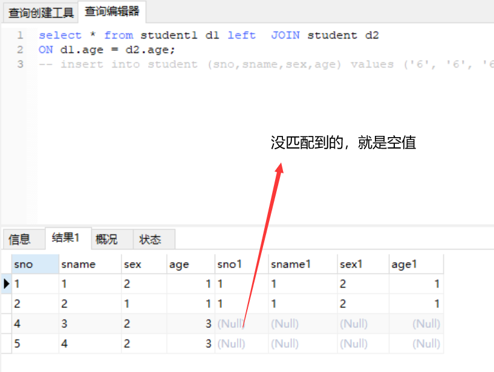

 5.复合连接（多条件and连接）

SELECT Student.Sno,  Student.Sname

  FROM    Student, SC

  **WHERE** Student.Sno = SC.Sno **AND** 

​    SC.Cno= 'E12002' **AND** SC.Grade >= 80  ;

​																					//2020-04-21

##### 嵌套查询

一个SELECT-FROM-WHERE语句称为一个查询块。

将一个查询块**嵌套在另一个查询块的WHERE子句**或**将查询快结果作为临时表来用**的查询称为嵌套查询。

注意：嵌入的查询块要用**小括号**包裹

小括号内的为子查询，之外的，父查询

子查询限制：不能使用order by ，这只能用来对最终结果使用

执行策略：

不相关子查询：可单独执行

相关子查询：条件与父查询有关，不可单独执行，父查询的元组会去验证子查询的返回值是否为true

在条件中，   in （多个结果）  确定是一个结果可用等号替换     =（单个结果）

典例：

查询未选择A课程的学生信息

将条件写  ！= ’A‘     ？（结果是错的，学生可多个课程，在课程表中，完全可以将选择A课程的学生因为选了其他课程的记录而被捕获）

select * from sname where not in （select name from sc where class = ’A‘）

有时可以代替连接查询：

查询选修了课程名为“离散数学”的学生学号和姓名

SELECT Sno, Sname 

  FROM    Student

  WHERE Sno  IN

  (SELECT Sno

  FROM    SC

​    WHERE  Cno IN

  (SELECT Cno

  FROM Course

  WHERE Cname=  '

离散数学

' ));

**连接查询：**

SELECT   Student.Sno, Sname

​     FROM    Student,  SC,  Course

​     WHERE   Student.Sno = SC.Sno  AND

​                     SC.Cno = Course.Cno  AND

​                     Course.Cname= '

离散数学

' ; 

区别：前者，缩圈，后者，大范围，多条件去找

​																					//2020-04-23